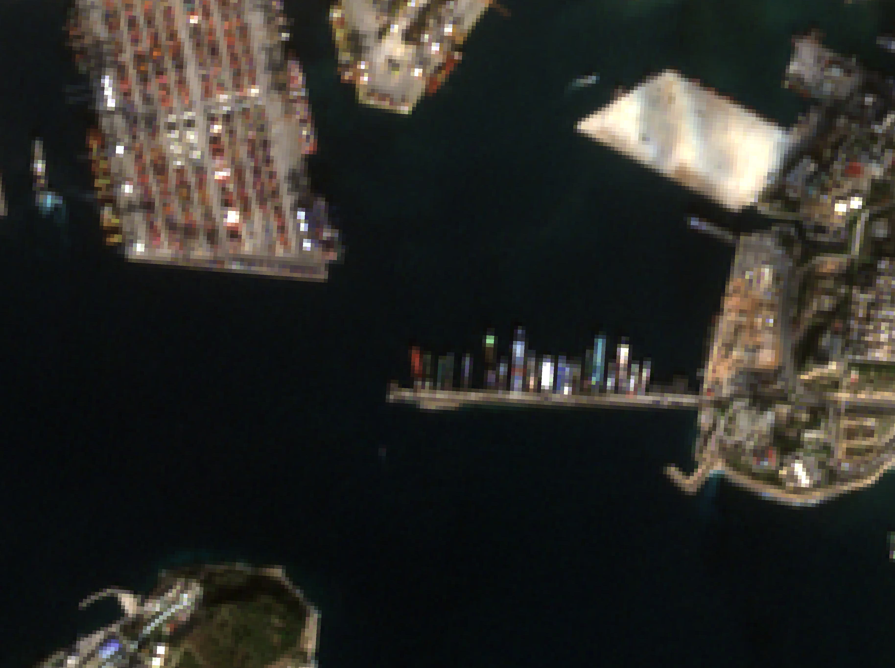
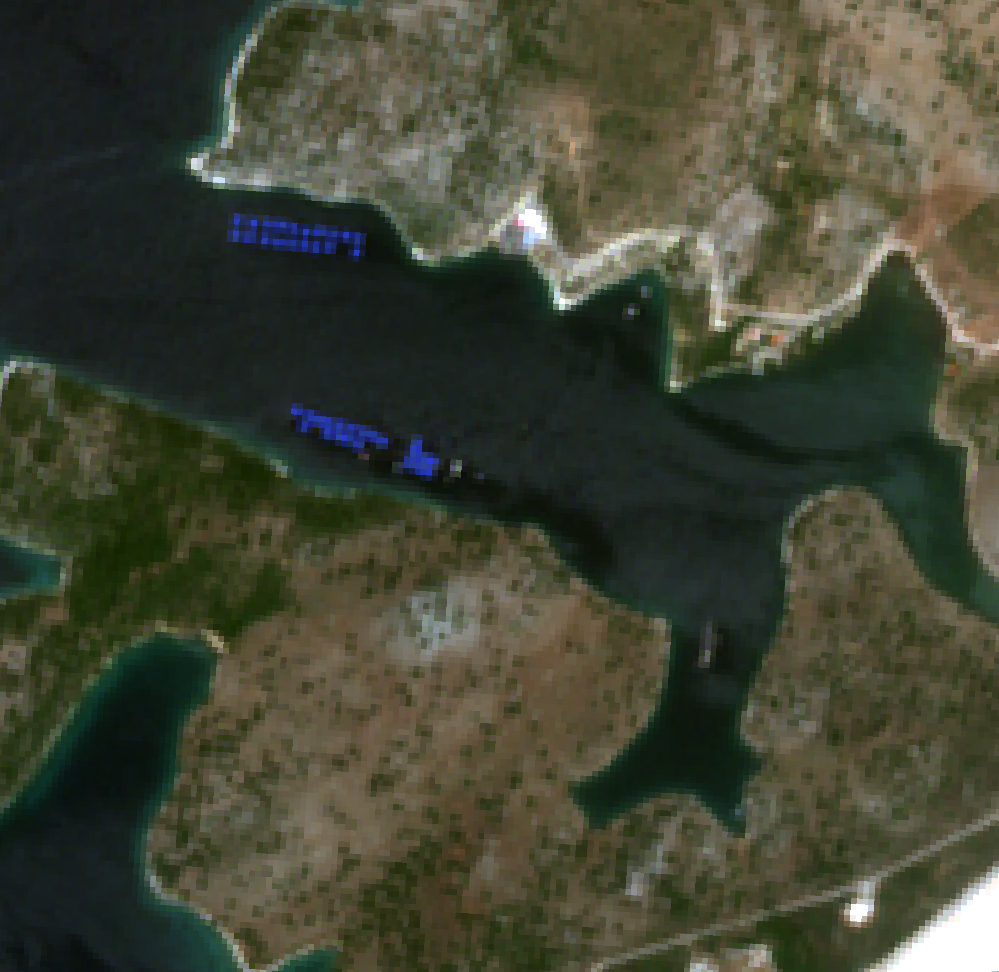
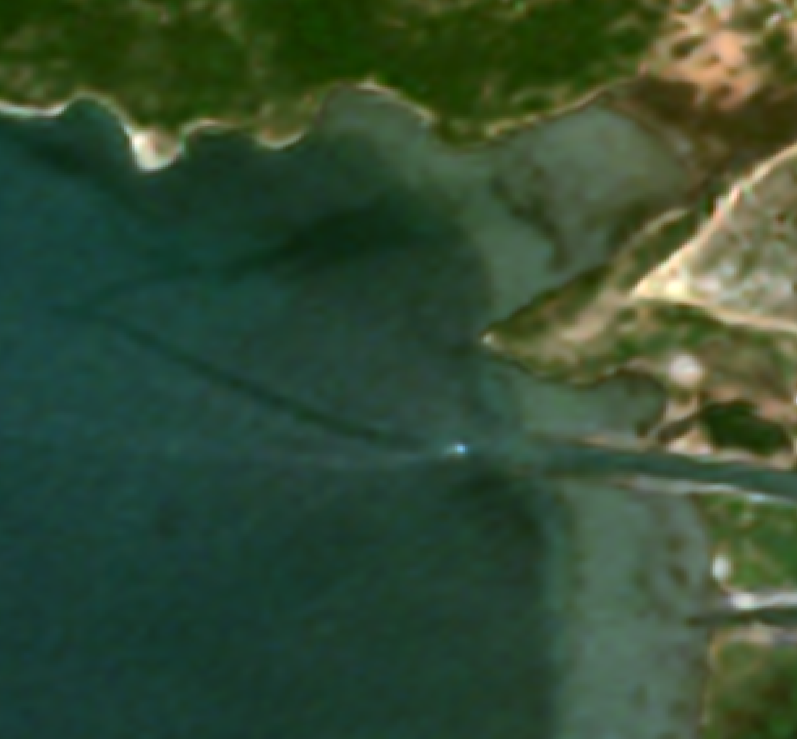

# 🌍 S2Swin4x: Sentinel-2 Super-Resolution using SwinIR (4×)

**S2Swin4x** is a lightweight and reproducible pipeline for enhancing the spatial resolution of Sentinel-2 imagery from 10 m to 2.5 m using a pretrained [SwinIR](https://github.com/JingyunLiang/SwinIR) model. The model was trained on the open-access [WorldStrat](https://worldstrat.github.io/) dataset.

<p align="center">
  
</p>

---

## 🛰️ Key Features

- **End-to-End Notebook**: From preprocessing to visualization in a single demo.
- **SwinIR 4× Upscaling**: Based on the powerful Swin Transformer architecture.
- **GeoTIFF Support**: Maintains CRS and transform metadata.
- **Interactive Viewer**: Compare input and super-resolved outputs side-by-side with `jupyter-compare-view`.

---

## 📁 Repository Structure

```
S2Swin4x/
├── data/               # Sample Sentinel-2 input image 
├── models/
│   ├── swinir_weights.pth     # Pretrained SwinIR weights
│   └── network_swinir.py      # SwinIR model definition
├── utils/
│   ├── normalize_image.py     # Scaling and Normalization functions
│   ├── s2_preprocessing.py    # resampling and cropping pipeline
│   └── scaler.pkl             # Scaler file
├── super_resolution.py        # Main inference function
├── reverse_scaling.py         # Converts normalized output to uint16
├── demo.ipynb                 # Step-by-step usage notebook
├── requirements.txt
└── README.md
```

---

## 🚀 How to Run

### ✅ Create a Conda Environment

You can set up a clean Python environment with the required dependencies using `conda`:

```bash
# 1. Create and activate the environment
conda create -n s2swin4x python=3.8 -y
conda activate s2swin4x

# 2. Install dependencies
pip install -r requirements.txt
```

> 💡 Tip: You can also install Jupyter support via:
>
> ```bash
> pip install ipykernel
> python -m ipykernel install --user --name=s2swin4x
> ```

---

## 📦 Dependencies

- Python ≥ 3.8
- PyTorch
- rasterio
- scikit-image
- scikit-learn
- affine
- fiona
- shapely
- matplotlib
- jupyter-compare-view (optional, for image sliders)

---

## 📓 Demo Notebook

A complete step-by-step walkthrough is provided in the **`demo.ipynb`** notebook.  
You’ll see how to:

- Download and prepare Sentinel-2 imagery (10 m resolution).
- Normalize it using preprocessing parameters aligned with the training dataset.
- Run super-resolution inference using a pre-trained SwinIR model (4× upscaling).
- Reverse the normalization to restore physical reflectance values.
- Compare the input and super-resolved outputs interactively using slider tools.

The notebook is fully annotated with explanations, visualizations, and key takeaways, so you can both **understand** and **experiment** with the pipeline easily.

---

## 🖼️ Example Output

Below are visual comparisons between the original 10 m Sentinel-2 RGB image and the super-resolved 2.5 m RGB output produced by our SwinIR model:

| Input (10 m) | Super-Resolved (2.5 m) |
|--------------|------------------------|
|  |  |
|  |  |

> 📌 **Note:**  
> Interactive comparison sliders are available in the [demo notebook](./demo.ipynb)

---

## 📚 Source Components

This work builds upon the following resources:

- **SwinIR: Image Restoration Using Swin Transformer**  
  Authors: Jingyun Liang, Jiezhang Cao, Guolei Sun, Kai Zhang, Luc Van Gool, Radu Timofte  
  Publication: arXiv preprint, 2021  
  License: Apache 2.0  
  [Project GitHub](https://github.com/JingyunLiang/SwinIR) • [arXiv Link](https://arxiv.org/abs/2108.10257)

- **WorldStrat: Open High-Resolution Satellite Imagery Dataset**  
  Authors: Julien Cornebise, Ivan Orsolic, Freddie Kalaitzis  
  Conference: NeurIPS 2022 Datasets and Benchmarks Track  
  [Dataset Website](https://worldstrat.github.io/) • [OpenReview Link](https://openreview.net/forum?id=DEigo9L8xZA)

  **Licensing of WorldStrat:**
  - High-resolution imagery (e.g. `hr_dataset.tar.gz`, `hr_dataset_raw.tar.gz`): **CC BY-NC 4.0** ([details](https://creativecommons.org/licenses/by-nc/4.0/))
  - Low-resolution imagery: **CC BY 4.0** ([details](https://creativecommons.org/licenses/by/4.0/))
 

---


## 📬 Contact

Questions or feedback? Feel free to open an issue or reach out.
